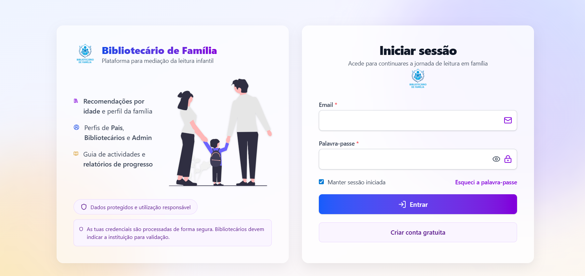
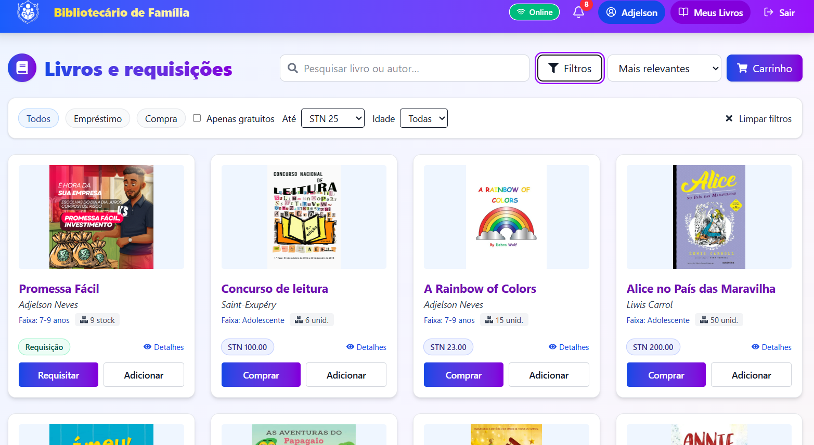
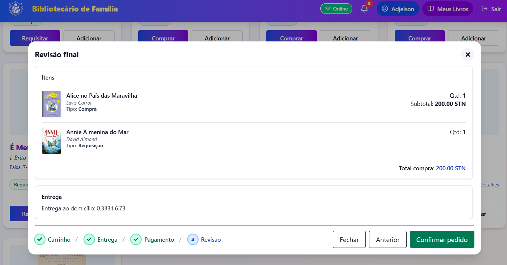
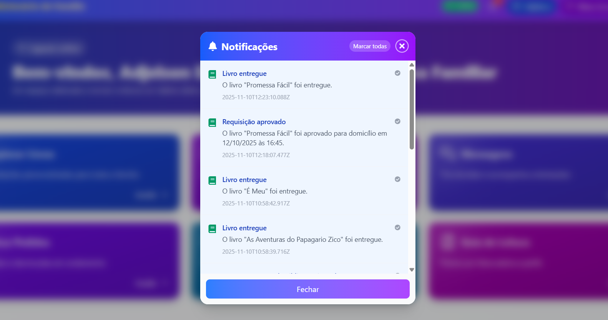
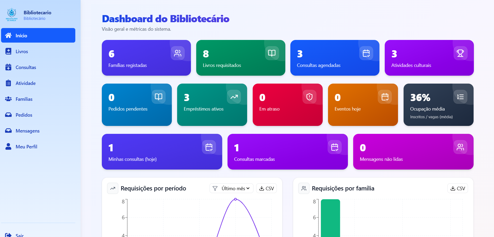

# Bibliotecário de Família

> Plataforma digital desenvolvida como projeto de conclusão de curso para apoiar a promoção da leitura infantil em São Tomé e Príncipe.


**Figura 1 — Ecrã de autenticação da plataforma.**  
**Fonte:** Captura de ecrã do sistema Bibliotecário de Família, elaboração própria.

---

## Resumo do projeto

A leitura na primeira infância é determinante para o desenvolvimento cognitivo, linguístico e social. Em São Tomé e Príncipe, persistem desafios relevantes, como o acesso reduzido a livros infantis, desigualdades na cobertura bibliotecária e escassez de soluções digitais centradas no apoio às famílias.

O projeto **Bibliotecário de Família** foi concebido para responder a esse contexto através de uma plataforma web que aproxima famílias, bibliotecários e bibliotecas. A solução permite disponibilizar recomendações de leitura, apoiar o acompanhamento da evolução leitora das crianças, facilitar o agendamento de consultas com bibliotecários e reforçar a mediação de leitura em ambiente familiar.

A implementação foi desenvolvida com **React, TypeScript, Tailwind CSS, Node.js, Express, Prisma e MySQL**, seguindo uma arquitetura baseada em **APIs REST**. O sistema foi construído com foco em **usabilidade, acessibilidade, responsividade, segurança e escalabilidade**, incluindo autenticação com **JWT**, controlo de acesso por perfis (**RBAC**) e estrutura preparada para funcionamento moderno em ambiente web.

Este trabalho enquadra-se numa abordagem **exploratória-descritiva**, permitindo levantar necessidades, estruturar a proposta tecnológica e validar a viabilidade da solução do ponto de vista técnico e social.

**Palavras-chave:** leitura infantil, usabilidade, acessibilidade, bibliotecas digitais, mediação de leitura, PWA.

---

## Objetivo geral

Desenvolver uma plataforma digital de apoio à leitura infantil que permita às famílias em São Tomé e Príncipe aceder a recursos, serviços e orientação bibliotecária de forma simples, acessível e segura.

## Objetivos específicos

- Promover hábitos de leitura no contexto familiar.
- Facilitar o acesso a livros e conteúdos adequados à faixa etária da criança.
- Aproximar famílias e bibliotecários por meio de consultas e acompanhamento.
- Disponibilizar uma interface moderna, responsiva e intuitiva.
- Estruturar um sistema com autenticação e permissões por perfil.
- Apoiar a transformação digital de serviços de biblioteca com impacto social.

---

## Visão geral da solução

A plataforma está dividida em duas camadas principais:

- **Frontend:** interface web para famílias, bibliotecários e administradores.
- **Backend:** API responsável por autenticação, regras de negócio, persistência de dados, notificações e gestão dos módulos do sistema.

### Perfis de utilizador

- **PAI** — responsável familiar que utiliza a plataforma para leitura, consultas, requisições e acompanhamento.
- **BIBLIOTECARIO** — profissional que gere livros, consultas, famílias, atividades e mediação.
- **ADMIN** — utilizador com visão global e gestão administrativa do sistema.

---

## Tecnologias utilizadas

### Frontend

- React 19
- TypeScript
- Vite
- Tailwind CSS
- Chakra UI
- TanStack Router
- React Query
- Zustand
- Axios
- Framer Motion
- Vitest
- Playwright

### Backend

- Node.js
- Express
- TypeScript
- Prisma ORM
- MySQL
- Zod
- JWT
- bcryptjs
- cookie-parser
- cors
- helmet
- multer
- Vitest

---

## Galeria de interfaces

### 1. Login


**Figura 2 — Página de login da plataforma.**  
**Fonte:** Captura de ecrã do sistema Bibliotecário de Família, elaboração própria.

### 2. Registo de utilizador


**Figura 3 — Interface de criação de conta para acesso ao sistema.**  
**Fonte:** Captura de ecrã do sistema Bibliotecário de Família, elaboração própria.

### 3. Dashboard da família


**Figura 4 — Painel principal da família com acesso rápido a livros, consultas, mensagens, pedidos e guia de leitura.**  
**Fonte:** Captura de ecrã do sistema Bibliotecário de Família, elaboração própria.

### 4. Livros e requisições



**Figura 5 — Área de consulta e requisição de livros para utilização familiar.**  
**Fonte:** Captura de ecrã do sistema Bibliotecário de Família, elaboração própria.

### 5. Carrinho / pedidos



**Figura 6 — Fluxo de carrinho e pedidos associado à experiência do utilizador.**  
**Fonte:** Captura de ecrã do sistema Bibliotecário de Família, elaboração própria.

### 6. Notificações



**Figura 7 — Área de notificações para acompanhamento de ações e eventos do sistema.**  
**Fonte:** Captura de ecrã do sistema Bibliotecário de Família, elaboração própria.

### 7. Histórico de consultas



**Figura 8 — Ecrã de histórico de consultas realizadas pela família.**  
**Fonte:** Captura de ecrã do sistema Bibliotecário de Família, elaboração própria.

### 8. Formulário de marcação de consulta


**Figura 9 — Interface de submissão de pedido de consulta com bibliotecário.**  
**Fonte:** Captura de ecrã do sistema Bibliotecário de Família, elaboração própria.

### 9. Gestão de livros


**Figura 10 — Vista administrativa orientada à gestão de livros e respetivos dados.**  
**Fonte:** Captura de ecrã do sistema Bibliotecário de Família, elaboração própria.

### 10. Gestão de bibliotecas


**Figura 11 — Interface administrativa para gestão de bibliotecas e configurações associadas.**  
**Fonte:** Captura de ecrã do sistema Bibliotecário de Família, elaboração própria.

---

# Backend — Biblioteca da Família

O backend da plataforma **Bibliotecário de Família** foi desenvolvido com **Node.js, Express, TypeScript, Prisma e MySQL**. Esta camada é responsável pela autenticação, persistência de dados, regras de negócio, autorização por perfil e exposição dos serviços REST consumidos pelo frontend.

A API foi estruturada para suportar um sistema multiutilizador com foco em bibliotecas, famílias e mediação de leitura. Entre as responsabilidades do backend estão:

- autenticação e gestão de sessão;
- gestão de famílias, bibliotecários e administradores;
- catálogo de livros e comentários;
- consultas com bibliotecários;
- requisições e devoluções;
- carrinho, pedidos e pagamentos;
- notificações, mensagens e atividades;
- indicadores e estatísticas operacionais.

## Arquitetura técnica do backend

A camada backend segue uma arquitetura modular baseada em Express e Prisma:

```text
Cliente Web (Frontend)
        ↓
API REST (Express + TypeScript)
        ↓
Camada de validação e middleware
        ↓
Prisma ORM
        ↓
MySQL
```

## Stack principal

- Node.js
- Express
- TypeScript
- Prisma ORM
- MySQL
- Zod
- JWT
- bcryptjs
- cookie-parser
- cors
- helmet
- multer
- Vitest

## Requisitos

- Node.js 18 ou superior
- npm 9 ou superior
- MySQL/MariaDB compatível com Prisma

## Instalação

```bash
npm install
```

## Configuração do ambiente

Crie o ficheiro `.env` com base no `.env.example`.

### Exemplo

```env
PORT=4000
NODE_ENV=development
CORS_ORIGIN=http://localhost:5173
FRONTEND_ORIGIN=http://localhost:5173
JWT_ACCESS_SECRET=dev_super_secret_access
JWT_REFRESH_SECRET=dev_super_secret_refresh
JWT_ACCESS_EXPIRES=15m
JWT_REFRESH_EXPIRES=7d
BCRYPT_SALT_ROUNDS=10
COOKIE_SECURE=false
COOKIE_SAMESITE=lax
DATABASE_URL="mysql://root:@127.0.0.1:3306/biblioteca_familia"
```

### Significado das variáveis principais

- `PORT`: porta da API.
- `CORS_ORIGIN`: origem autorizada para consumo do frontend.
- `FRONTEND_ORIGIN`: origem usada na validação de sessão e refresh token.
- `JWT_ACCESS_SECRET`: segredo do access token.
- `JWT_REFRESH_SECRET`: segredo do refresh token.
- `JWT_ACCESS_EXPIRES`: validade do token de acesso.
- `JWT_REFRESH_EXPIRES`: validade do token de renovação.
- `BCRYPT_SALT_ROUNDS`: custo de hash das palavras-passe.
- `COOKIE_SECURE`: deve ser `true` em produção com HTTPS.
- `COOKIE_SAMESITE`: política do cookie de sessão.
- `DATABASE_URL`: string de ligação à base de dados MySQL.

## Base de dados

O backend utiliza **Prisma** com provider **MySQL**, permitindo modelação consistente, migrations controladas e seed inicial do sistema.

### Gerar o cliente Prisma

```bash
npm run prisma:generate
```

### Aplicar migrations em desenvolvimento

```bash
npm run prisma:migrate
```

### Aplicar migrations em produção

```bash
npm run prisma:deploy
```

### Executar seed

```bash
npm run seed
```

### Reset da base de testes

```bash
npm run db:test:reset
```

## Como executar

### Desenvolvimento

```bash
npm run dev
```

### Build

```bash
npm run build
```

### Produção

```bash
npm start
```

## Scripts disponíveis

```bash
npm run dev
npm run build
npm start
npm run prisma:generate
npm run prisma:migrate
npm run prisma:deploy
npm run seed
npm run db:test:reset
npm run test:api
```

## Estrutura principal

```text
src/
├─ app.ts                 # configuração do Express
├─ server.ts              # arranque do servidor
├─ env.ts                 # leitura e validação das variáveis de ambiente
├─ prisma.ts              # acesso ao Prisma
├─ lib/
│  └─ prisma.ts           # helper Prisma
├─ middleware/            # autenticação, autorização e wrappers assíncronos
├─ routes/                # rotas da API
├─ utils/                 # JWT e utilitários diversos
└─ types/                 # extensões de tipos

prisma/
├─ schema.prisma          # schema da base de dados
└─ seed.ts                # seed inicial
```

## Módulos da API

### 1. Autenticação
Base: `/auth`

- `POST /auth/register`
- `POST /auth/login`
- `POST /auth/refresh`
- `GET /auth/me`
- `POST /auth/logout`

### 2. Famílias
Base: `/familia`

- `GET /familia`
- `GET /familia/me`
- `GET /familia/minha/filhos`
- `POST /familia`
- `PUT /familia/:id`
- `DELETE /familia/:id`

### 3. Livros
Base: `/livros`

- `GET /livros`
- `GET /livros/:id`
- `POST /livros`
- `PUT /livros/:id`
- `DELETE /livros/:id`
- `POST /livros/:id/ajuste-quantidade`
- `GET /livros/:id/comentarios`
- `POST /livros/:id/comentarios`
- `POST /livros/:id/capa`

### 4. Consultas
Base: `/consultas`

- `GET /consultas/disponibilidade`
- `GET /consultas/bibliotecarios`
- `GET /consultas/familias`
- `POST /consultas`
- `GET /consultas`
- `GET /consultas/:id`
- `PATCH /consultas/:id`
- `POST /consultas/:id/responder`
- `POST /consultas/:id/cancelar`
- `DELETE /consultas/:id`

### 5. Requisições
Base: `/requisicoes`

- `POST /requisicoes`
- `GET /requisicoes`
- `GET /requisicoes/minhas`
- `GET /requisicoes/minhas-em-posse`
- `PUT /requisicoes/:id`
- `POST /requisicoes/:id/aprovar`
- `POST /requisicoes/:id/despachar`
- `POST /requisicoes/:id/entregar`
- `POST /requisicoes/:id/devolver`
- `POST /requisicoes/:id/pagar`
- `POST /requisicoes/:id/cancelar`

### 6. Requisições do utilizador
Base: `/requisicoes-user`

- `GET /requisicoes-user/minhas`
- `GET /requisicoes-user/minhas/em-posse`

### 7. Carrinho e checkout
Base: `/carrinho`

- `GET /carrinho`
- `POST /carrinho/itens`
- `PUT /carrinho/itens/:id`
- `DELETE /carrinho/itens/:id`
- `POST /carrinho/checkout`
- `POST /carrinho/pagamentos/:pedidoId/iniciar`
- `POST /carrinho/pagamentos/:pedidoId/confirmar`
- `POST /carrinho/pagamentos/:pedidoId/falhou`

### 8. Pedidos da loja
Base: `/pedidos-loja`

- `GET /pedidos-loja/minhas`
- `GET /pedidos-loja/:id`
- `POST /pedidos-loja`
- `PATCH /pedidos-loja/:id/status`
- `POST /pedidos-loja/:id/itens`
- `PUT /pedidos-loja/:id/itens/:itemId`
- `DELETE /pedidos-loja/:id/itens/:itemId`

### 9. Bibliotecas
Base: `/bibliotecas`

- `GET /bibliotecas/public`
- `GET /bibliotecas`
- `GET /bibliotecas/:id`
- `POST /bibliotecas`
- `PUT /bibliotecas/:id`
- `PATCH /bibliotecas/:id`
- `DELETE /bibliotecas/:id`

### 10. Utilizadores
Base: `/utilizadores`

- `GET /utilizadores`
- `GET /utilizadores/:id`
- `POST /utilizadores`
- `PUT /utilizadores/:id`
- `PATCH /utilizadores/:id`
- `DELETE /utilizadores/:id`
- `GET /utilizadores/:id/horario`
- `PUT /utilizadores/:id/horario`
- `PATCH /utilizadores/:id/horario/:horarioId`
- `DELETE /utilizadores/:id/horario/:horarioId`

### 11. Atividades / eventos
Base: `/eventos`

- `GET /eventos`
- `GET /eventos/:id`
- `POST /eventos`
- `PUT /eventos/:id`
- `PATCH /eventos/:id`
- `DELETE /eventos/:id`
- `POST /eventos/:id/imagem`
- `POST /eventos/:id/inscricoes`
- `DELETE /eventos/:id/inscricoes`
- `GET /eventos/:id/inscricoes`
- `DELETE /eventos/:id/inscricoes/:participanteId`
- `GET /eventos/minhas-inscricoes`
- `POST /eventos/:id/presenca/self`

### 12. Notificações
Base: `/notificacoes`

- `GET /notificacoes`
- `GET /notificacoes/unread-count`
- `GET /notificacoes/stats`
- `POST /notificacoes/:id/read`
- `POST /notificacoes/read-many`
- `POST /notificacoes/read-all`
- `DELETE /notificacoes/:id`
- `DELETE /notificacoes/read-all`
- `POST /notificacoes`
- `POST /notificacoes/bulk`

### 13. Mensagens
Base: `/mensagens`

Módulo dedicado à troca de mensagens internas entre os diferentes perfis do sistema.

### 14. Estatísticas
Base: `/stats`

- `GET /stats/kpis`
- `GET /stats/kpis-plus`
- `GET /stats/inventario/alertas`
- `GET /stats/requisicoes`
- `GET /stats/requisicoes-por-familia`
- `GET /stats/top-livros`
- `GET /stats/requisicoes/status`
- `GET /stats/consultas/resumo`
- `GET /stats/requisicoes/export/csv`
- `GET /stats/familia/export/csv`
- `GET /stats/top-livros/export/csv`

## Modelos principais da base de dados

Entre os principais modelos Prisma estão:

- `Biblioteca`
- `User`
- `Familia`
- `Filho`
- `Livro`
- `Consulta`
- `Requisicao`
- `Carrinho`
- `Pedido`
- `Pagamento`
- `Mensagem`
- `Notificacao`
- `Atividade` / `Evento`

## Segurança implementada

- `helmet` para endurecimento de headers HTTP;
- `cors` configurado com origem permitida;
- `cookie-parser` para refresh token em cookie;
- JWT para autenticação e renovação de sessão;
- `bcryptjs` para hash seguro de palavras-passe;
- middleware de autorização por perfil;
- validação de payload com Zod;
- tratamento centralizado de erros.

## Uploads

O backend serve ficheiros estáticos em:

```text
/uploads
```

Exemplos de uso:

- imagens de eventos;
- capas de livros.

Diretório físico esperado:

```text
uploads/
```

## Healthcheck

```http
GET /
```

Resposta esperada:

```json
{ "ok": true }
```

## Testes

```bash
npm run test:api
```

## Fluxo recomendado para arranque local

1. Criar a base de dados MySQL.
2. Configurar o ficheiro `.env`.
3. Executar `npm install`.
4. Executar `npm run prisma:generate`.
5. Aplicar as migrations.
6. Executar o seed inicial, se necessário.
7. Iniciar a API com `npm run dev`.

## Problemas comuns

### Erro de CORS

Verifique se `CORS_ORIGIN` corresponde exatamente ao domínio e porta do frontend.

### Refresh token não funciona

Verifique:

- `FRONTEND_ORIGIN`
- `COOKIE_SECURE`
- `COOKIE_SAMESITE`
- coerência entre HTTP e HTTPS

### Prisma não liga à base de dados

Verifique:

- `DATABASE_URL`
- credenciais MySQL
- porta configurada
- existência da base de dados

### Uploads não aparecem

Verifique se a pasta `uploads/` existe e se o backend possui permissões de leitura e escrita.

## Resumo do backend

O backend foi estruturado para suportar uma aplicação multi-perfil orientada à mediação de leitura familiar, com autenticação baseada em JWT, organização modular, persistência com Prisma/MySQL e suporte a uploads, notificações e estatísticas.

---

# Frontend — Biblioteca da Família

O frontend da plataforma **Bibliotecário de Família** foi desenvolvido com **React, TypeScript e Vite**, tendo como objetivo oferecer uma experiência moderna, acessível e responsiva para os diferentes perfis do sistema.

A interface atende três grupos principais:

- **Família / Pai:** consultar livros, fazer requisições, acompanhar pedidos, marcar consultas e participar em atividades.
- **Bibliotecário:** gerir livros, consultas, famílias, mensagens, pedidos e atividades.
- **Admin:** gerir bibliotecas, utilizadores e a visão global da plataforma.

## Arquitetura funcional do frontend

```text
Interface React
      ↓
Gestão de estado e sessão
      ↓
Cliente Axios
      ↓
API REST do backend
```

## Stack principal

- React 19
- TypeScript
- Vite
- TanStack Router
- Zustand
- Axios
- Tailwind CSS
- Chakra UI
- React Query
- Framer Motion
- Vitest
- Playwright

## Requisitos

- Node.js 18 ou superior
- npm 9 ou superior
- Backend em execução

## Instalação

```bash
npm install
```

## Configuração do ambiente

Crie um ficheiro `.env` na raiz do frontend com:

```env
VITE_API_URL=http://localhost:4000
```

### Exemplos de uso

- Desenvolvimento local: `http://localhost:4000`
- Produção: `https://seu-dominio-api.com`

## Como executar

### Desenvolvimento

```bash
npm run dev
```

O Vite normalmente sobe em:

```text
http://localhost:5173
```

### Build de produção

```bash
npm run build
```

### Pré-visualização da build

```bash
npm run preview
```

## Scripts disponíveis

```bash
npm run dev
npm run build
npm run preview
npm run lint
npm run test:unit
npm run test:unit:watch
npm run test:e2e
npm run test:e2e:ui
npm run test:e2e:headed
npm run test:e2e:report
```

## Estrutura principal

```text
src/
├─ api/                # cliente Axios, autenticação e integração com backend
├─ assets/             # imagens, logos e ícones
├─ components/         # componentes reutilizáveis
├─ pages/
│  ├─ admin/           # páginas administrativas e de bibliotecário
│  └─ user/            # páginas orientadas à família
├─ routes/             # definição e proteção de rotas
├─ session/            # gestão de sessão e atividade
├─ store/              # estado global da autenticação
└─ main.tsx            # bootstrap da aplicação
```

## Funcionalidades implementadas

### Área pública

- página inicial;
- página sobre;
- login;
- registo;
- termos e política de privacidade;
- recuperação de palavra-passe (interface).

### Área da família

- dashboard da família;
- perfil;
- consultas;
- meus livros;
- requisição de livros;
- atividades;
- mensagens;
- guia;
- pedidos;
- ajuda.

### Área do bibliotecário / admin

- dashboard;
- perfil do bibliotecário;
- gestão de livros;
- gestão de consultas;
- gestão de bibliotecas;
- gestão de famílias;
- gestão de mensagens;
- gestão de pedidos;
- gestão de utilizadores;
- atividades.

## Autenticação

O frontend utiliza:

- **access token** para chamadas autenticadas;
- **refresh token em cookie httpOnly**;
- renovação automática de sessão via interceptor Axios.

### Fluxo resumido

1. O utilizador faz login.
2. O backend devolve `accessToken` e define o cookie de refresh.
3. O frontend guarda os dados de sessão no store.
4. Se uma request devolver `401`, o cliente tenta `/auth/refresh` automaticamente.
5. Se falhar, a sessão é encerrada.

## Rotas e permissões

As rotas são protegidas por perfil.

### Perfis esperados

- `PAI`
- `BIBLIOTECARIO`
- `ADMIN`

### Comportamento esperado

- utilizador não autenticado é redirecionado para `/login`;
- utilizador autenticado sem permissão é redirecionado para a área adequada.

## Integração com o backend

O frontend comunica com a API principalmente através do ficheiro:

```text
src/api/client.ts
```

Configuração principal:

- `baseURL = VITE_API_URL`
- `withCredentials = true` no cliente autenticado
- header `Authorization: Bearer <token>`
- refresh automático de token

## Uploads e imagens

Imagens e ficheiros servidos pelo backend podem ser resolvidos a partir de caminhos relativos usando o helper `imageUrl()`.

Exemplo de origem esperada:

```text
http://localhost:4000/uploads/...
```

## Qualidade e testes

### Testes unitários

```bash
npm run test:unit
```

### Testes E2E

```bash
npm run test:e2e
```

### Lint

```bash
npm run lint
```

## Observações importantes

- O frontend depende do backend estar ativo e com CORS configurado corretamente.
- Em produção, `VITE_API_URL` deve apontar para a URL real da API.
- Como o refresh token usa cookie, a configuração de domínio, `SameSite` e `Secure` no backend deve estar coerente com o ambiente.

## Fluxo recomendado para desenvolvimento

1. Iniciar a base de dados.
2. Iniciar o backend.
3. Configurar `VITE_API_URL`.
4. Executar o frontend com `npm run dev`.

## Problemas comuns

### O frontend abre mas não carrega dados

Verifique:

- se o backend está ativo;
- se `VITE_API_URL` está correto;
- se o CORS do backend permite o domínio do frontend.

### Login funciona mas depois perde sessão

Verifique:

- `COOKIE_SECURE`
- `COOKIE_SAMESITE`
- `FRONTEND_ORIGIN`
- `CORS_ORIGIN`
- uso coerente de HTTP vs HTTPS

### Imagens não aparecem

Verifique:

- se a pasta `/uploads` está a ser servida pelo backend;
- se os caminhos gravados na base de dados estão corretos.

## Resumo do frontend

O frontend foi organizado para suportar autenticação por perfil, consumo de API REST, separação de painéis por tipo de utilizador e evolução contínua com testes, componentes reutilizáveis e estrutura moderna para crescimento do produto.

---

## Credenciais de teste

```text
Admin:
admin@bibliotecario.st
admin123

Bibliotecário:
bib@bibliotecario.st
bib123456

Família:
edmar@gmail.com
adjels0nnit9
```

---

## Impacto social do projeto

O **Bibliotecário de Família** não é apenas uma aplicação técnica. Trata-se de uma proposta com valor educativo e social, orientada para:

- incentivo à leitura infantil;
- apoio às famílias no acompanhamento da criança;
- fortalecimento da mediação entre biblioteca e comunidade;
- modernização de serviços bibliotecários;
- inclusão digital em contexto educativo.

## Conclusão

O projeto demonstra que tecnologias web modernas podem ser aplicadas a problemas concretos de educação e inclusão. Ao integrar frontend, backend, autenticação segura, perfis de acesso e fluxos de acompanhamento da leitura, a solução apresenta-se como uma base consistente para expansão futura e implementação real.
